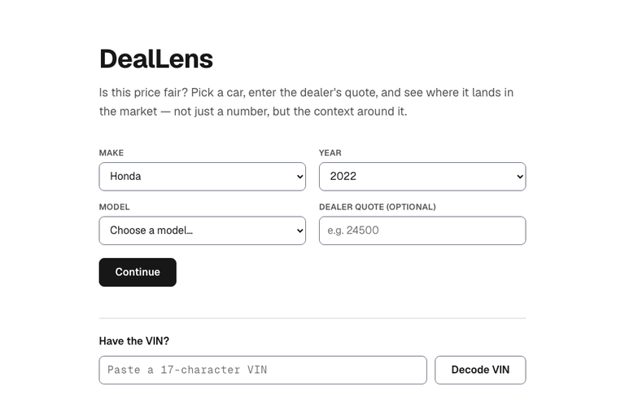
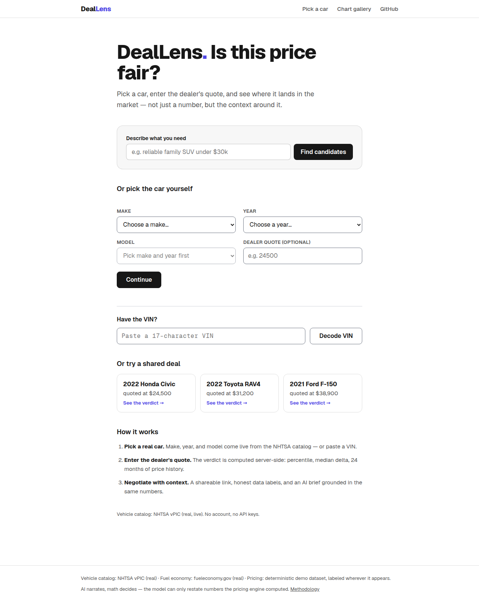
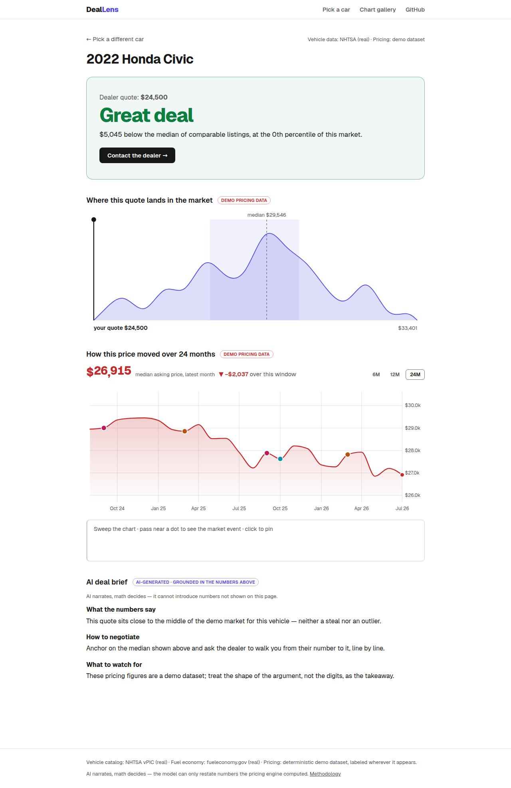
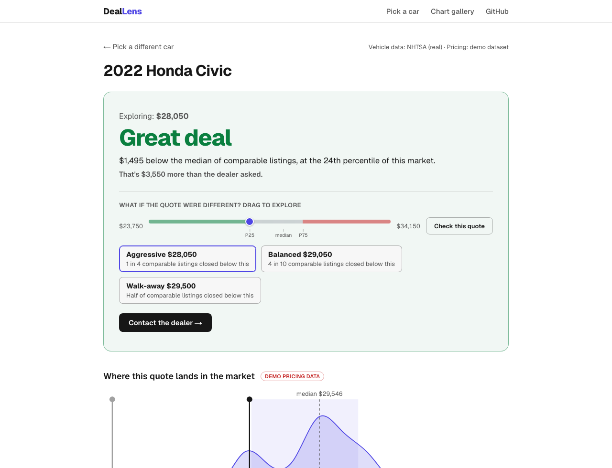
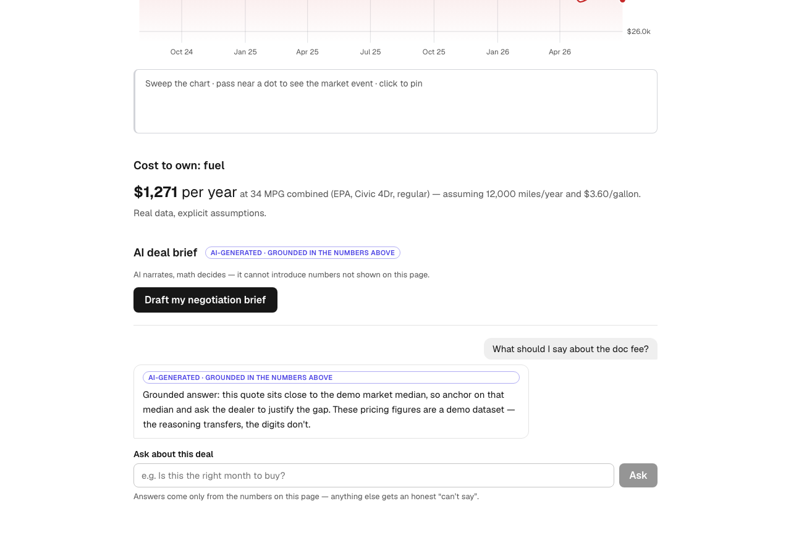
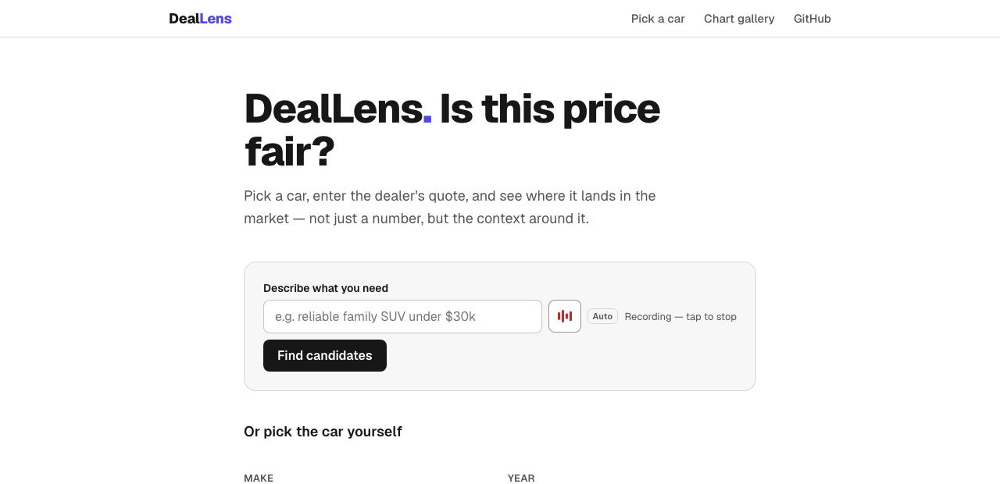
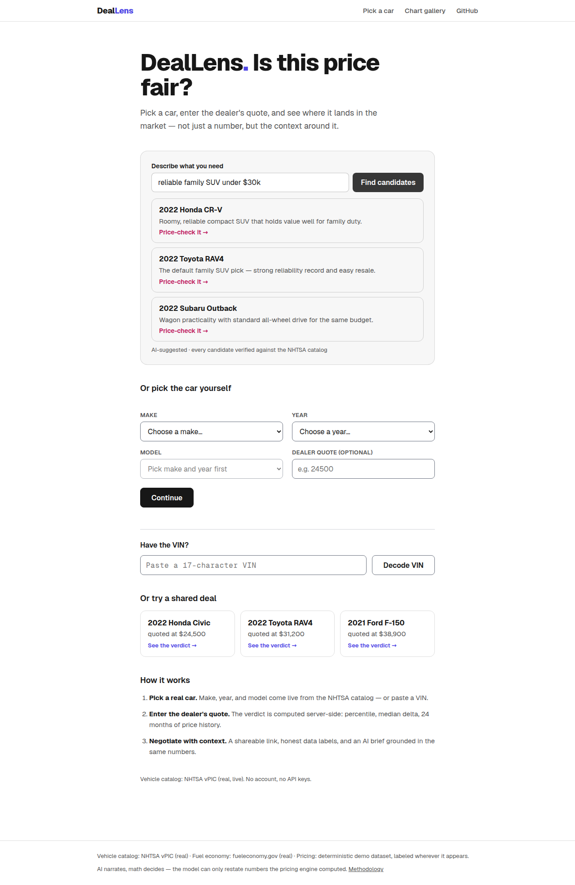
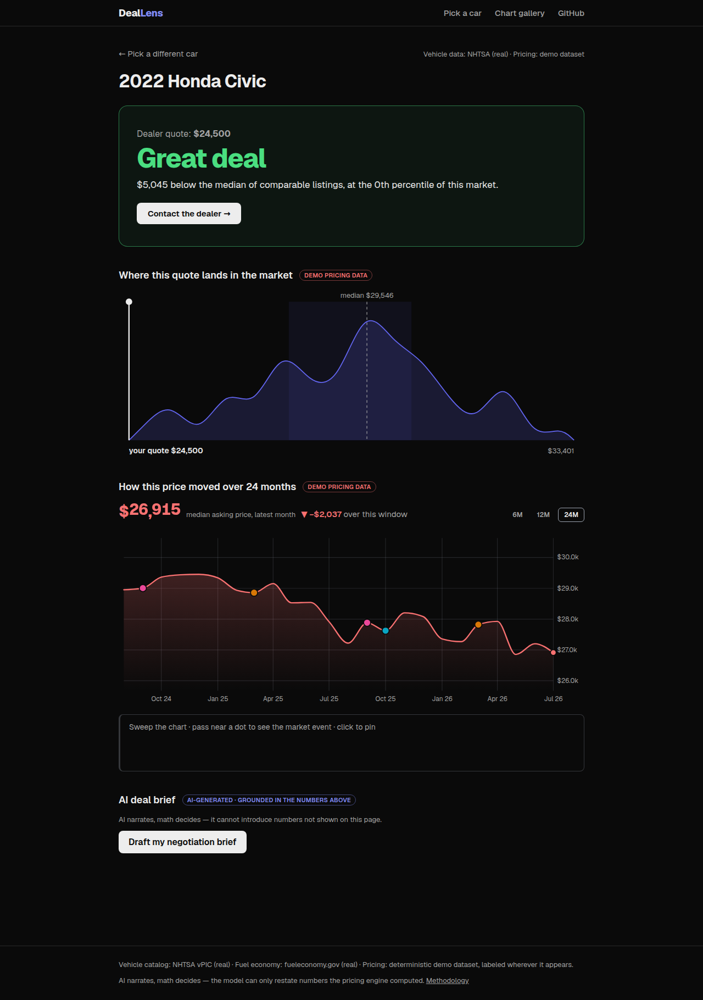
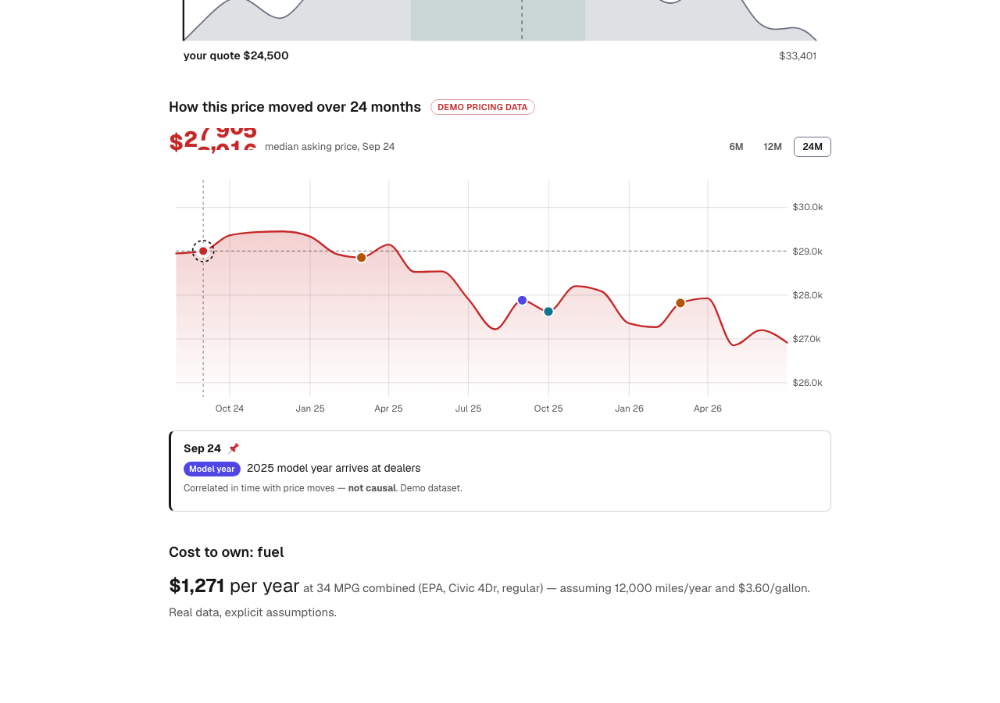

# DealLens — Is this price fair?

**Pricing as context, not a number.** Pick a real vehicle, enter the
dealer's quote, and see where it lands: the market distribution around
it, how prices moved over 24 months, and the market events pinned to
those moves.

> **Live demo:** [deallens-xi.vercel.app](https://deallens-xi.vercel.app) — try a [shared deal link](https://deallens-xi.vercel.app/deal/honda/2022/civic?quote=24500) · **Chart gallery:** [/dev/charts](https://deallens-xi.vercel.app/dev/charts) · **API playground:** [/api/graphql](https://deallens-xi.vercel.app/api/graphql)



## Why this exists

Edmunds says it is "in the business of trust." This demo treats trust
as an engineering problem, in three mechanisms:

1. **The conclusion is isomorphic.** The verdict ("Great deal — $5,045
   below the median, 12th percentile") is computed on the server and
   rendered as HTML. Share the link with a family member; it reads
   correctly with JavaScript disabled. A dedicated Playwright project
   (`chromium-no-js`) enforces this on every page, permanently.
2. **Data honesty is typed.** Real API data (NHTSA vPIC, EPA
   fueleconomy.gov) is unlabeled. Synthetic pricing data carries a
   "Demo pricing data" badge everywhere it appears — and a
   `DataSourceTag: REAL | DEMO` enum in the GraphQL schema, so the UI
   can't forget to ask. Thin markets get an honest empty state
   ("not enough data to say — and we won't guess"), never interpolation.
3. **Performance is a gate, not a goal.** Lighthouse CI budgets fail
   the build: Performance ≥ 95, LCP < 2.5 s, CLS < 0.1, TBT < 200 ms,
   on all three pages.

## Measured results

| Page | Perf | A11y | Best Practices | SEO | LCP | CLS | TBT |
| ---- | ---- | ---- | -------------- | --- | --- | --- | --- |
| `/` (picker) | **100** | 100 | 100 | 100 | 0.52 s | 0 | 0 ms |
| `/deal/…` (dashboard) | **100** | 100 | 100 | 100 | 0.51 s | 0 | 0 ms |
| `/contact` (lead form) | **100** | 100 | 100 | 100 | 0.51 s | 0 | 0 ms |

First-load JavaScript, measured over the wire (gzip): picker 70 KB,
dashboard 48 KB, contact 74 KB — all far under the 150 KB budget. The
D3-flavored interactive chunks load only when a chart scrolls into
view.

Tests: **89 unit/contract tests** (Vitest) + **56 E2E runs** across
chromium, firefox, webkit, and the no-JS project (Playwright). CI runs
lint → typecheck → unit → build → E2E matrix → Lighthouse budget gate.

## Architecture

```
Browser ──► Next.js App Router (all pages SSR, Node runtime)
              │
              ├─ Server Components ──┐  in-process execution
              │                      ▼  (same schema, no HTTP hop)
              └─ /api/graphql ► graphql-yoga gateway ── GraphiQL
                                   │
                     ┌─────────────┼──────────────────┐
                     ▼             ▼                  ▼
               sources/vpic  sources/fueleconomy  sources/pricing-gen
               (NHTSA, real) (EPA, real)          (synthetic, DEMO-tagged)
                     │             │                  │
                     └──── domain/ pure functions ────┘
                    percentile · verdict · focusDomain ·
                    clusterEvents · fuelCost · histogram
                    (zero dependencies, 100% unit-tested)
```

- **Every number is computed server-side or in a pure function** —
  percentiles, verdict thresholds, fuel-cost math. Components only
  render. The pure-function layer has no dependencies and full unit
  coverage of edge cases (empty samples, ties, single points).
- **URL is the only state** (`/deal/honda/2022/civic?quote=24500`):
  shareable, SSR-trivial, one code path for the no-JS form flow and
  the enhanced instant cascade. No Redux — [ADR 002](docs/adr/002-url-as-state.md)
  explains why that's a decision, not an omission.
- **Charts are isomorphic D3**: pure math modules → pure SVG components
  the server renders completely → interactivity hydrated in place when
  visible, animating only transform/opacity/textContent through refs.
  [ADR 001](docs/adr/001-isomorphic-d3.md).
- **The gateway classifies errors** (`UPSTREAM_TIMEOUT` vs
  `INVALID_INPUT` vs `UPSTREAM_FORMAT_DRIFT`) and caches at two tiers
  (DataLoader per request, day-TTL across requests).
  [ADR 003](docs/adr/003-graphql-gateway.md).

## The signature component

`PriceHistoryTimeline` is a direct port of the god-mode timeline from
the author's [smart-money-decoder](https://github.com/LianCr/smart-money-decoder)
(there: news × prediction-market odds; here: market events × asking
prices — same design language: draw *why it's this price* next to
*what the price is*). Sweep the chart and the price follows on an
odometer ticker; pass near an event dot and it activates; click to pin
it so the story survives your pointer leaving. The port table and
design notes live in the
[component README](src/components/charts/PriceHistoryTimeline/README.md);
what's new here is the SSR static skeleton upgraded in place on
hydration — an isomorphic D3 chart with zero layout shift.

## The negotiation explorer

The dashboard's "what if the quote were different?" slider is a
decision tool, not a readout. Before you drag, the answer is already
on the track: it is colored by verdict zone (Great deal ≤ P25, Fair to
P75, Above market past it), the quartiles are soft snap detents, and
three counter-offer chips — Aggressive (P25) · Balanced (P40) ·
Walk-away (median) — each carry one line of statistical grounding
("1 in 4 comparable listings closed below this"). While exploring, the
dealer's real quote stays anchored: a dimmed ghost marker holds its
place on the chart and the hero reframes the delta as money ("You'd
save $1,850 vs the dealer's quote"). The explored price then flows
into the actions around it — the AI brief targets it (one extra FACTS
line, same grounding rules) and the contact form arrives pre-filled
with the offer.

All of it reruns the *same* zero-dependency domain functions the
server rendered with (`assessDeal`, `percentileRank`,
`percentileValue`), fed the same `samples` field the GraphQL gateway
exposes; the chart marker moves through transform-only DOM mutations
(zero D3 in the island), and the URL tracks the explored quote via
debounced `replaceState`, so any link you share server-renders the
same conclusion. Without JavaScript the slider is a plain GET form and
every chip is a real link the server answers — isomorphic JavaScript
demonstrated in both directions.

## Data sources & honesty methodology

| Source | Status | Notes |
| ------ | ------ | ----- |
| NHTSA vPIC | **Real, live** | Models merged across car/mpv/truck vehicle types (an unfiltered query mixes in motorcycles). Unknown makes return HTTP 200 + empty `Results` — handled as an answer, not an error. VIN errors are detected from the payload's `ErrorCode`, never the HTTP status. |
| EPA fueleconomy.gov | **Real, live** | JSON via `Accept` header (verified live — no XML parsing). Model names differ from vPIC ("Civic" vs "Civic 4Dr"): fuzzy prefix match, and when nothing matches the fuel-cost bar is hidden rather than guessed. Single-entry menus arrive as an object, not a one-item array — normalized at the decode boundary. |
| Pricing dataset | **Synthetic, DEMO-tagged** | No free API exposes real transaction prices. Instead of faking realism: deterministic seeded generation (same vehicle → same market, always), parameters documented in [`pricing-gen.ts`](src/sources/pricing-gen.ts), a DEMO badge at every appearance, and ~5% of vehicles get a deliberately thin market so the honest empty state stays demonstrable. Swapping in a real source (e.g. Marketcheck) is one adapter behind the same `PriceContext` resolver — the schema already carries the `REAL` tag for it. |

All upstream client behavior is locked by **contract tests against
real captured payloads** (`src/fixtures/`) — format drift fails loudly
instead of rendering an empty picker.

## AI, constrained: "AI narrates, math decides"

Edmunds was the first US car-shopping platform on ChatGPT plugins, and
its [GenAI blueprint with Databricks](https://www.databricks.com/blog/how-edmunds-builds-blueprint-generative-ai)
is explicitly data-centric: ground the LLM on proprietary structured
data instead of using a general model bare. This repo implements that
idea at demo scale, as an extension of the honesty red lines
([ADR 005](docs/adr/005-ai-native.md)):

- **AI deal brief** (dashboard): a streamed negotiation brief whose
  every number comes from a server-computed FACTS block
  ([`src/ai/dealFacts.ts`](src/ai/dealFacts.ts), pure + snapshot-tested).
  The route accepts identifiers only and recomputes the pricing context
  in-process — client numbers never reach the prompt. The output is
  permanently labeled "AI-generated · grounded in the numbers above."
- **Natural-language finder** (landing): "reliable family SUV under
  $30k" → up to 3 candidates via structured outputs, constrained to the
  29-make whitelist, then **verified against the live vPIC catalog —
  hallucinated models are dropped, and the UI says how many**.
- **Ask about this deal** (dashboard): multi-turn follow-up Q&A under
  the brief. Every question re-grounds server-side — the route accepts
  identifiers plus the question only, rebuilds the FACTS block, and
  replays at most 4 prior turns; the prompt treats user text strictly
  as a question, never as instructions. Deliberately uncached — the
  rate guard is the spend ceiling.
- **Real web research** (brief + Q&A): the coach does homework on the
  exact vehicle via Anthropic's server-side web-search tool — open
  recalls, current incentives, widely-reported model issues — with
  every finding attributed to its source inline. Web findings never
  replace the FACTS block as this deal's verdict math; `max_uses` caps
  per-request searches and `AI_WEB_SEARCH=0` turns it off
  ([ADR 005](docs/adr/005-ai-native.md)).
- **Voice input, two tiers** on both NL surfaces
  ([ADR 006](docs/adr/006-voice-input.md)): the keyless default is the
  browser's Web Speech API, tuned to survive mid-sentence pauses
  (continuous mode + a silence endpointer) with a persisted language
  toggle (Auto/EN/中文). With an optional `STT_API_KEY`, dictation
  upgrades to the ChatGPT shape — record with a live level meter, then
  one accurate Whisper-family transcript — behind the same BYOK
  pattern and shared rate guard; audio is never stored, and Firefox
  (no Web Speech) gains dictation through this tier. Either way the
  transcript stays editable and is never auto-submitted, and the mic
  renders only where some tier can actually work.
- **Cost guardrails**: per-IP + global daily limits with honest 429
  copy, a response cache bucketed by vehicle + quote (deterministic
  pricing → most traffic is free), `MOCK_AI=1` for zero-cost
  deterministic CI/E2E, and a bring-your-own-key card when no
  `ANTHROPIC_API_KEY` is configured — clone-and-run stays keyless.

Model: `claude-opus-4-8` (streaming for the brief, structured outputs
for the finder, low effort for short copy). Worst-case spend is capped
under $6/day by the global budget; the cache keeps actual spend far
lower.

## Getting started

```bash
npm install
npm run dev        # no API keys — all sources are free public APIs
```

AI features are optional: add `ANTHROPIC_API_KEY=…` to `.env.local` to
enable them locally. Without a key, the AI surfaces degrade to an
honest explanation and everything else works. `STT_API_KEY=…`
(optional, OpenAI) upgrades voice dictation to a Whisper-family model
(`STT_MODEL` to override which); without it, dictation uses the
browser's own speech service where available.

| Command | What it does |
| ------- | ------------ |
| `npm test` | Unit + contract tests (Vitest) |
| `npm run test:e2e` | Playwright: 3 browsers + no-JS project (build first) |
| `npm run lint` / `npm run typecheck` | ESLint / strict TypeScript |
| `npx lhci autorun` | Lighthouse budget gate, same as CI |

## Screenshots

| | |
| --- | --- |
|  |  |
|  |  |
|  |  |
|  |  |
