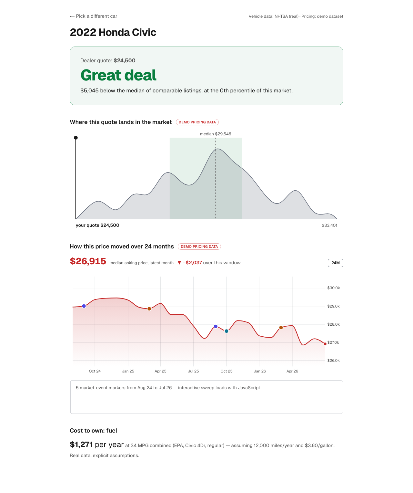
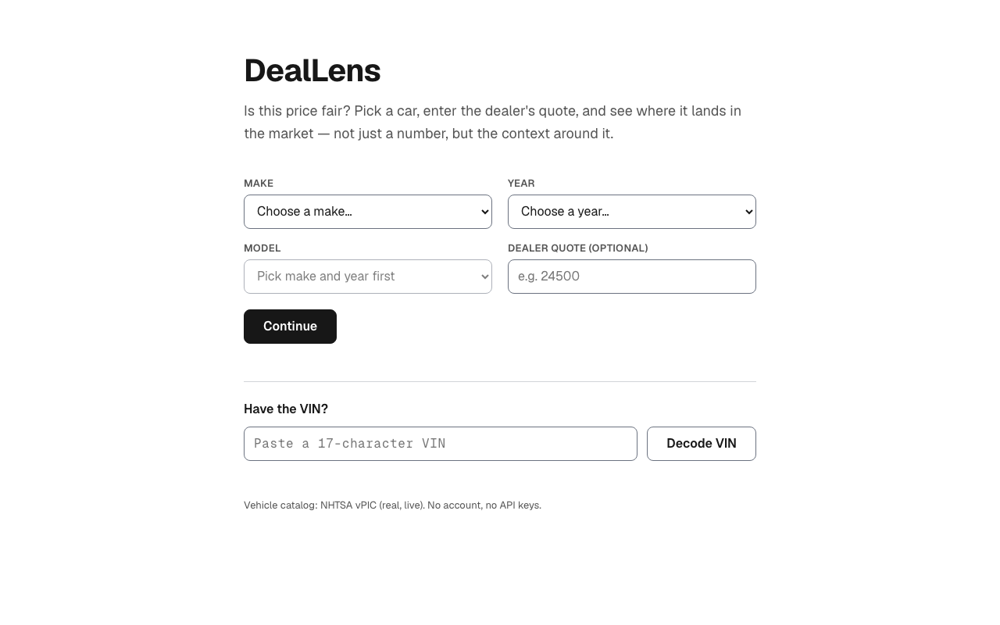
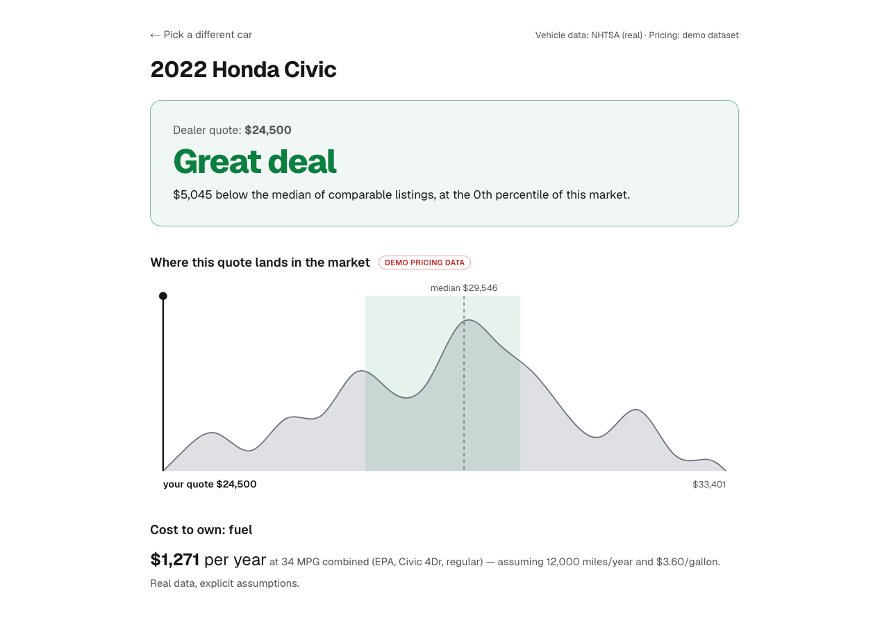
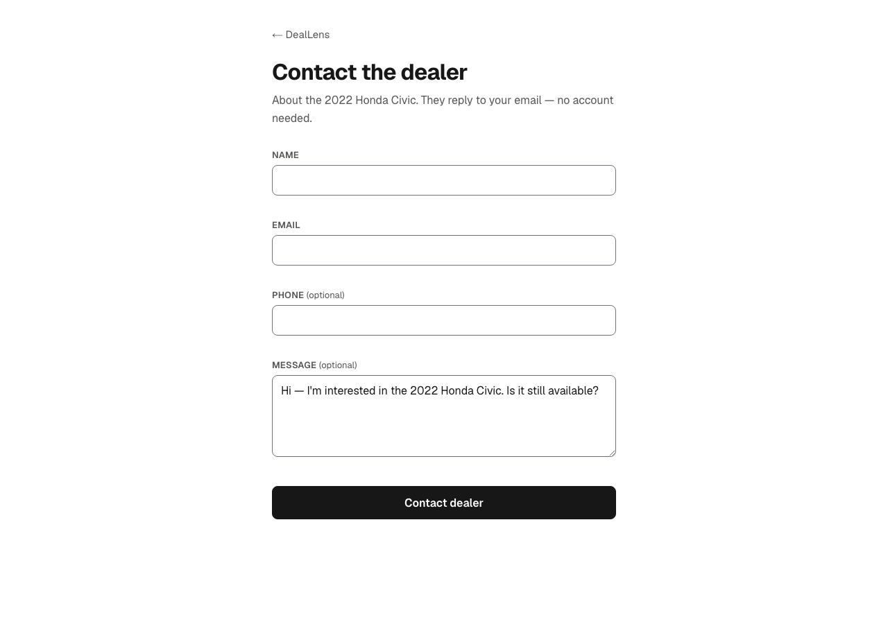

# DealLens — Is this price fair?

**Pricing as context, not a number.** Pick a real vehicle, enter the
dealer's quote, and see where it lands: the market distribution around
it, how prices moved over 24 months, and the market events pinned to
those moves.

> **Live demo:** _deploying — URL lands here_ · **Chart gallery:** `/dev/charts` · **API playground:** `/api/graphql`



## Why this exists

Edmunds says it is "in the business of trust." This demo treats trust
as an engineering problem, in three mechanisms:

1. **The conclusion is isomorphic.** The verdict ("Great deal — $5,045
   below the median, 12th percentile") is computed on the server and
   rendered as HTML. Share the link with a family member; it reads
   correctly with JavaScript disabled. A dedicated Playwright project
   (`chromium-no-js`) enforces this on every page, permanently.
2. **Data honesty is typed.** Real API data (NHTSA vPIC, EPA
   fueleconomy.gov) is unlabeled. Synthetic pricing data carries a
   "Demo pricing data" badge everywhere it appears — and a
   `DataSourceTag: REAL | DEMO` enum in the GraphQL schema, so the UI
   can't forget to ask. Thin markets get an honest empty state
   ("not enough data to say — and we won't guess"), never interpolation.
3. **Performance is a gate, not a goal.** Lighthouse CI budgets fail
   the build: Performance ≥ 95, LCP < 2.5 s, CLS < 0.1, TBT < 200 ms,
   on all three pages.

## Measured results

| Page | Perf | A11y | Best Practices | SEO | LCP | CLS | TBT |
| ---- | ---- | ---- | -------------- | --- | --- | --- | --- |
| `/` (picker) | **100** | 100 | 100 | 100 | 0.52 s | 0 | 0 ms |
| `/deal/…` (dashboard) | **100** | 100 | 100 | 100 | 0.51 s | 0 | 0 ms |
| `/contact` (lead form) | **100** | 100 | 100 | 100 | 0.51 s | 0 | 0 ms |

First-load JavaScript, measured over the wire (gzip): picker 70 KB,
dashboard 48 KB, contact 74 KB — all far under the 150 KB budget. The
D3-flavored interactive chunks load only when a chart scrolls into
view.

Tests: **89 unit/contract tests** (Vitest) + **53 E2E runs** across
chromium, firefox, webkit, and the no-JS project (Playwright). CI runs
lint → typecheck → unit → build → E2E matrix → Lighthouse budget gate.

## Architecture

```
Browser ──► Next.js App Router (all pages SSR, Node runtime)
              │
              ├─ Server Components ──┐  in-process execution
              │                      ▼  (same schema, no HTTP hop)
              └─ /api/graphql ► graphql-yoga gateway ── GraphiQL
                                   │
                     ┌─────────────┼──────────────────┐
                     ▼             ▼                  ▼
               sources/vpic  sources/fueleconomy  sources/pricing-gen
               (NHTSA, real) (EPA, real)          (synthetic, DEMO-tagged)
                     │             │                  │
                     └──── domain/ pure functions ────┘
                    percentile · verdict · focusDomain ·
                    clusterEvents · fuelCost · histogram
                    (zero dependencies, 100% unit-tested)
```

- **Every number is computed server-side or in a pure function** —
  percentiles, verdict thresholds, fuel-cost math. Components only
  render. The pure-function layer has no dependencies and full unit
  coverage of edge cases (empty samples, ties, single points).
- **URL is the only state** (`/deal/honda/2022/civic?quote=24500`):
  shareable, SSR-trivial, one code path for the no-JS form flow and
  the enhanced instant cascade. No Redux — [ADR 002](docs/adr/002-url-as-state.md)
  explains why that's a decision, not an omission.
- **Charts are isomorphic D3**: pure math modules → pure SVG components
  the server renders completely → interactivity hydrated in place when
  visible, animating only transform/opacity/textContent through refs.
  [ADR 001](docs/adr/001-isomorphic-d3.md).
- **The gateway classifies errors** (`UPSTREAM_TIMEOUT` vs
  `INVALID_INPUT` vs `UPSTREAM_FORMAT_DRIFT`) and caches at two tiers
  (DataLoader per request, day-TTL across requests).
  [ADR 003](docs/adr/003-graphql-gateway.md).

## The signature component

`PriceHistoryTimeline` is a direct port of the god-mode timeline from
the author's [smart-money-decoder](https://github.com/nicklien307)
(there: news × prediction-market odds; here: market events × asking
prices — same design language: draw *why it's this price* next to
*what the price is*). Sweep the chart and the price follows on an
odometer ticker; pass near an event dot and it activates; click to pin
it so the story survives your pointer leaving. The port table and
design notes live in the
[component README](src/components/charts/PriceHistoryTimeline/README.md);
what's new here is the SSR static skeleton upgraded in place on
hydration — an isomorphic D3 chart with zero layout shift.

## Data sources & honesty methodology

| Source | Status | Notes |
| ------ | ------ | ----- |
| NHTSA vPIC | **Real, live** | Models merged across car/mpv/truck vehicle types (an unfiltered query mixes in motorcycles). Unknown makes return HTTP 200 + empty `Results` — handled as an answer, not an error. VIN errors are detected from the payload's `ErrorCode`, never the HTTP status. |
| EPA fueleconomy.gov | **Real, live** | JSON via `Accept` header (verified live — no XML parsing). Model names differ from vPIC ("Civic" vs "Civic 4Dr"): fuzzy prefix match, and when nothing matches the fuel-cost bar is hidden rather than guessed. Single-entry menus arrive as an object, not a one-item array — normalized at the decode boundary. |
| Pricing dataset | **Synthetic, DEMO-tagged** | No free API exposes real transaction prices. Instead of faking realism: deterministic seeded generation (same vehicle → same market, always), parameters documented in [`pricing-gen.ts`](src/sources/pricing-gen.ts), a DEMO badge at every appearance, and ~5% of vehicles get a deliberately thin market so the honest empty state stays demonstrable. Swapping in a real source (e.g. Marketcheck) is one adapter behind the same `PriceContext` resolver — the schema already carries the `REAL` tag for it. |

All upstream client behavior is locked by **contract tests against
real captured payloads** (`src/fixtures/`) — format drift fails loudly
instead of rendering an empty picker.

## Getting started

```bash
npm install
npm run dev        # no API keys — all sources are free public APIs
```

| Command | What it does |
| ------- | ------------ |
| `npm test` | Unit + contract tests (Vitest) |
| `npm run test:e2e` | Playwright: 3 browsers + no-JS project (build first) |
| `npm run lint` / `npm run typecheck` | ESLint / strict TypeScript |
| `npx lhci autorun` | Lighthouse budget gate, same as CI |

## JD mapping

Built as a working answer to the Edmunds Mid-Level Software Engineer
posting, line by line:

| The posting says | Where it is in this repo |
| ---------------- | ------------------------ |
| "revamping the way we present pricing" | The whole product: verdict + distribution + history timeline — pricing as context, not a number |
| "optimizing the performance of those pages" | Lighthouse CI budget gates (100/100/100/100 ×3 pages), 48–74 KB first-load JS, visibility-deferred chart hydration |
| "modern Javascript best practices and client-side application design" | RSC/SSR architecture, URL-as-state, server actions with progressive enhancement, React×D3 division of labor, ADRs |
| "building, unit testing, documenting, and refactoring client-side applications" | 100%-covered pure-function domain layer; per-component READMEs; the timeline is a documented refactor-port of production code |
| "testing strategies … cross-browser compatibility" | Four-layer pyramid: unit → component → contract-vs-fixtures → E2E in chromium/firefox/webkit + no-JS |
| "isomorphic Javascript (plus)" | Every conclusion server-rendered; usable with JS disabled (CI-enforced); isomorphic D3 skeletons |
| "designing APIs using GraphQL (plus)" | The gateway schema: honesty tags in the type system, nullable-by-design percentiles, classified error extensions ([ADR 003](docs/adr/003-graphql-gateway.md)) |
| "Node.js (plus)" | graphql-yoga gateway aggregating three upstreams, DataLoader, tiered caching |
| "cloud platform (plus)" | Vercel deployment + a concrete AWS Lambda/CloudFront migration path ([ADR 004](docs/adr/004-aws-deploy.md)) |
| "streamline the way customers reach out to dealers" | The contact page: a lead form that submits without JavaScript, validates at field level, never shifts layout, and scores 100×4 |
| "see projects through to completion" | This repo: CI green, deployed, plus a prior product in production ([smart-money-decoder](https://github.com/nicklien307)) |

## Screenshots

| | |
| --- | --- |
|  |  |
|  |  |
